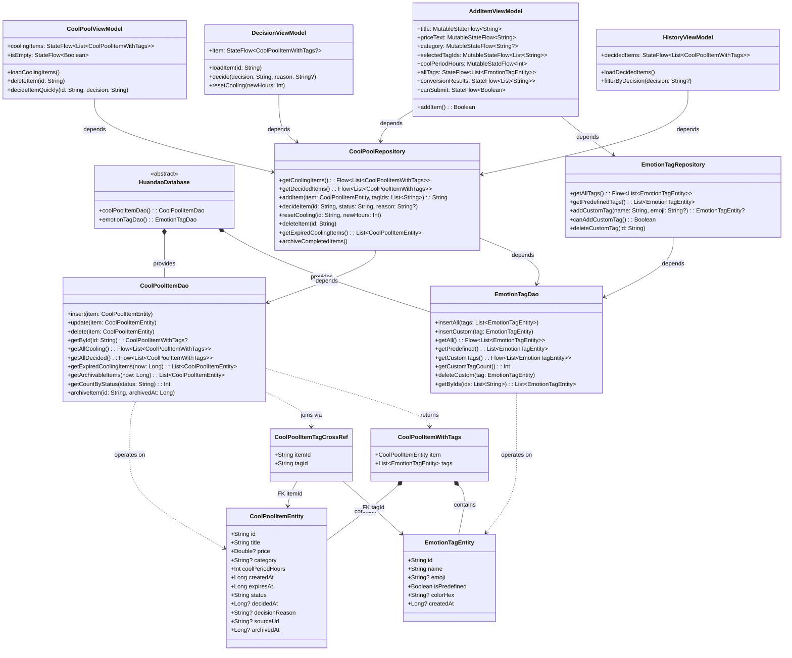
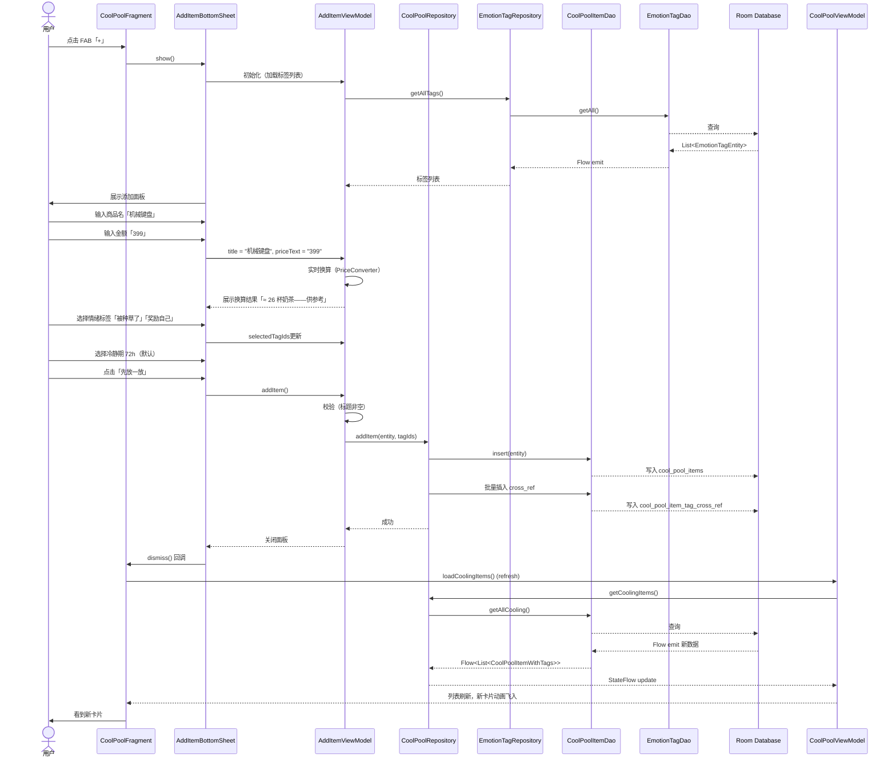
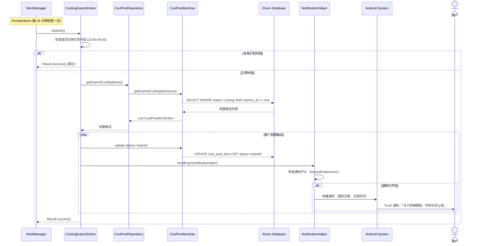
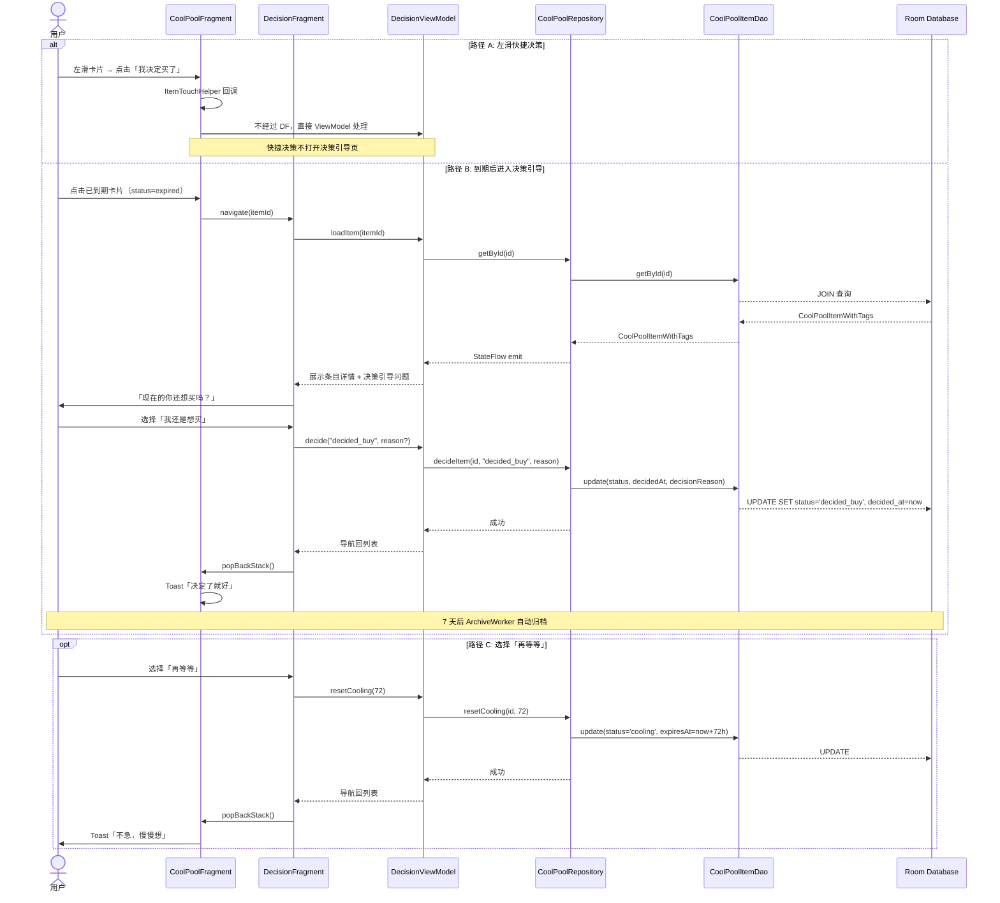
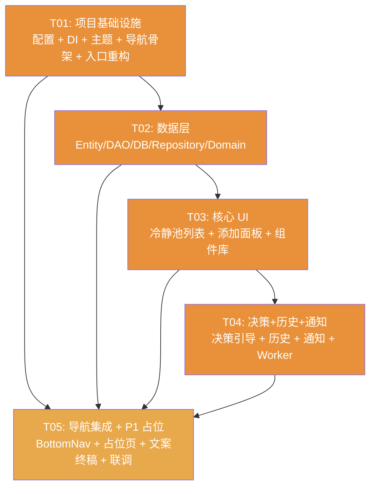

# 缓岛 V1.0 系统架构设计 & 任务分解

**文档版本**：V1.0-ARCH
**撰写日期**：2025年
**项目代号**：Huandao (com.huandao.app)
**作者**：Bob (Architect)

---

## Part A: 系统设计

---

### 1. 实现方案

#### 1.1 核心技术挑战

| 挑战 | 分析 | 解决方案 |
|------|------|----------|
| **WebView 套壳 → 原生重构** | 现有 MainActivity 是 WebView + JS Bridge 架构，需完全重写为多页面原生 App，同时保留 SplashScreen 和通知权限逻辑 | 以 Navigation Component + Fragment 架构替换 WebView，MainActivity 改为 Single-Activity NavHost 容器 |
| **离线优先 + 纯本地存储** | 无网络层、无云同步，所有数据存储在 Room 中，数据安全感和迁移性是用户核心关切 | Room 作为唯一数据源，P1 阶段通过 JSON 导出/导入实现数据迁移 |
| **冷静期到期精确提醒** | 多种冷静期（24h/72h/7d），需在到期时发送温和通知，不影响电池寿命 | WorkManager PeriodicWork + 应用内前台检查双保险，22:00-08:00 免打扰 |
| **情绪标签 N:M 关联** | 一个消费念头可关联最多 3 个情绪标签，标签可预设 + 自定义（上限 20） | Room 多对多关联表（cross_ref）+ 复合主键 |
| **状态机复杂性** | 5 种状态（cooling / expired / decided_buy / decided_pass）+ 状态转换 + 7 天归档 | Repository 层集中管理状态转换逻辑，DAO 层提供纯数据操作 |

#### 1.2 框架与库选型

| 库 | 版本 | 用途 | 选型理由 |
|----|------|------|----------|
| **Room** | 2.6.1 | 本地数据库 | Google 官方 ORM，编译期 SQL 校验，Flow 集成 |
| **Navigation Component** | 2.7.7 | 页面导航 | 官方 Fragment 导航方案，支持 BottomNavigation、SafeArgs、DeepLink |
| **ViewModel + StateFlow** | 2.7.0 | 状态管理 | 生命周期感知 + 响应式数据流，替代 LiveData 以获得更好的协程支持和类型安全 |
| **Hilt** | 2.50 | 依赖注入 | Google 官方 DI 方案，与 ViewModel/WorkManager 深度集成，编译期依赖校验 |
| **WorkManager** | 2.9.0 | 后台任务 | 官方推荐的后台任务调度，支持约束条件（免打扰时段），兼容 Doze 模式 |
| **Hilt Worker** | 2.50 | WorkManager DI | Hilt 对 WorkManager 的扩展支持 |
| **ViewBinding** | (AGP 内置) | 视图绑定 | 沿用项目现有模式，类型安全，无需 findViewById |
| **Splash Screen API** | 1.0.1 | 启动屏 | 保留现有配置，Android 12+ 官方方案 |
| **Material Components** | 1.12.0 | UI 组件 | 原生 Material 3 支持，BottomSheet、Chip、Card、NavigationBar 等 |

#### 1.3 架构模式

```
┌─────────────────────────────────────────────────────┐
│                   UI Layer (Fragment)                 │
│  ┌──────────┐ ┌──────────┐ ┌──────────┐             │
│  │Fragment  │ │Adapter   │ │Custom    │             │
│  │(View)    │ │(List)    │ │Views     │             │
│  └────┬─────┘ └──────────┘ └──────────┘             │
│       │ observes                                      │
│  ┌────┴─────┐                                       │
│  │ViewModel │ ← StateFlow<T>                         │
│  └────┬─────┘                                       │
├───────┼─────────────────────────────────────────────┤
│       │ calls                                        │
│  ┌────┴─────┐                                       │
│  │Repository│ ← 单一数据源 (Room)                    │
│  └────┬─────┘                                       │
│       │                                              │
│  ┌────┴─────┐     ┌──────────────┐                  │
│  │   DAO    │────▶│ Room Entities │                  │
│  └──────────┘     └──────────────┘                  │
│              Data Layer                              │
└─────────────────────────────────────────────────────┘
```

- **Single-Activity Architecture**: MainActivity 作为唯一天空母舰，承载 Navigation Component 的 NavHostFragment
- **MVVM + Repository**: Fragment (View) → ViewModel (State) → Repository (Data) → Room DAO
- **Hilt DI**: Application 级 Hilt 容器，ViewModel/Repository/DAO 全部依赖注入
- **WorkManager + Notification**: 独立于 UI 层的后台任务层，通过 Repository 读取数据库

---

### 2. 文件列表

#### 2.1 完整文件清单（按实现顺序分层）

```
app/src/main/java/com/huandao/app/
│
├── HuandaoApplication.kt                  # @HiltAndroidApp 入口
├── MainActivity.kt                        # Single-Activity, NavHost, BottomNav
│
├── di/
│   └── AppModule.kt                       # Hilt DI 模块（DB, Repository 绑定）
│
├── data/
│   ├── db/
│   │   ├── HuandaoDatabase.kt             # @Database 定义 + 预填充预设标签
│   │   ├── entity/
│   │   │   ├── CoolPoolItemEntity.kt       # 冷静池条目实体
│   │   │   ├── EmotionTagEntity.kt         # 情绪标签实体
│   │   │   └── CoolPoolItemTagCrossRef.kt  # 多对多关联实体
│   │   ├── dao/
│   │   │   ├── CoolPoolItemDao.kt          # 条目 DAO 接口
│   │   │   └── EmotionTagDao.kt            # 标签 DAO 接口
│   │   └── converter/
│   │       └── Converters.kt               # Room 类型转换器（Long↔Date等）
│   ├── repository/
│   │   ├── CoolPoolRepository.kt           # 条目数据仓库
│   │   └── EmotionTagRepository.kt         # 标签数据仓库
│   └── model/
│       └── CoolPeriod.kt                   # 冷静期时长枚举
│
├── domain/
│   └── model/
│       ├── CoolPoolItem.kt                 # 领域模型（含关联标签）
│       └── CoolPoolItemWithTags.kt         # 条目+标签聚合模型
│
├── ui/
│   ├── navigation/
│   │   └── NavGraph.kt                     # 导航图定义 + BottomNav 配置
│   ├── theme/
│   │   ├── Color.kt                        # 颜色常量
│   │   ├── Type.kt                         # 排版常量
│   │   └── Theme.kt                        # Compose/M3 主题（可选，XML 主题在 res）
│   ├── components/
│   │   ├── CoolPoolCardView.kt             # 自定义卡片 View
│   │   ├── EmotionTagChipView.kt           # 情绪标签 Chip
│   │   └── EmptyStateView.kt              # 空状态引导视图
│   ├── pool/
│   │   ├── CoolPoolFragment.kt             # 冷静池列表页
│   │   ├── CoolPoolViewModel.kt            # 列表状态管理
│   │   ├── CoolPoolAdapter.kt              # RecyclerView Adapter
│   │   ├── AddItemBottomSheet.kt           # 底部添加面板
│   │   └── AddItemViewModel.kt             # 添加面板状态管理
│   ├── decision/
│   │   ├── DecisionFragment.kt             # 决策引导页
│   │   └── DecisionViewModel.kt            # 决策状态管理
│   ├── history/
│   │   ├── HistoryFragment.kt              # 历史记录页（已决策条目）
│   │   └── HistoryViewModel.kt             # 历史状态管理
│   ├── insights/                           # P1 功能，V1 仅占位
│   │   └── InsightsFragment.kt             # 洞察报告页（Stub）
│   └── profile/                            # P1 功能，V1 仅占位
│       └── ProfileFragment.kt              # 个人中心页（Stub）
│
├── worker/
│   ├── CoolingExpiryWorker.kt              # 冷静期到期检查 Worker
│   └── ArchiveWorker.kt                   # 7 天归档 Worker
│
├── notification/
│   └── NotificationHelper.kt               # 通知渠道注册 + 推送构建
│
└── util/
    ├── PriceConverter.kt                   # 实物锚点换算引擎
    ├── TimeFormatter.kt                    # 友好时间展示工具
    └── Constants.kt                        # 全局常量（预设标签列表、禁用词校验等）
```

#### 2.2 资源文件清单

```
app/src/main/res/
├── layout/
│   ├── activity_main.xml                   # MainActivity 布局（NavHostFragment + BottomNav）
│   ├── fragment_cool_pool.xml              # 冷静池列表布局
│   ├── fragment_decision.xml               # 决策引导页布局
│   ├── fragment_history.xml                # 历史记录页布局
│   ├── fragment_insights.xml               # 洞察页布局（P1 占位）
│   ├── fragment_profile.xml                # 个人中心布局（P1 占位）
│   ├── item_cool_pool_card.xml             # 冷静池卡片 item 布局
│   ├── bottom_sheet_add_item.xml           # 添加面板 BottomSheet 布局
│   └── view_empty_state.xml                # 空状态复用布局
│
├── menu/
│   └── bottom_nav_menu.xml                 # BottomNavigation 菜单定义
│
├── navigation/
│   └── nav_graph.xml                       # Navigation Graph XML
│
├── drawable/
│   ├── ic_cool_pool.xml                    # Tab 1 图标（冷静池）
│   ├── ic_insights.xml                     # Tab 2 图标（洞察）
│   ├── ic_profile.xml                      # Tab 3 图标（个人中心）
│   └── ic_empty_box.xml                    # 空状态插画占位图标
│
└── values/
    ├── colors.xml                          # 扩展颜色定义
    ├── strings.xml                         # 全部文案（含禁用词校验）
    └── themes.xml                          # 保留现有 M3 主题 + SplashScreen 配置
```

---

### 3. 数据结构与接口

#### 3.1 类图



#### 3.2 核心接口签名（Kotlin）

**CoolPoolItemDao**
```kotlin
@Dao
interface CoolPoolItemDao {
    @Insert(onConflict = OnConflictStrategy.REPLACE)
    suspend fun insert(item: CoolPoolItemEntity)

    @Update
    suspend fun update(item: CoolPoolItemEntity)

    @Delete
    suspend fun delete(item: CoolPoolItemEntity)

    @Transaction
    @Query("SELECT * FROM cool_pool_items WHERE id = :id")
    suspend fun getById(id: String): CoolPoolItemWithTags?

    @Transaction
    @Query("SELECT * FROM cool_pool_items WHERE status IN ('cooling', 'expired') ORDER BY created_at DESC")
    fun getAllCooling(): Flow<List<CoolPoolItemWithTags>>

    @Transaction
    @Query("SELECT * FROM cool_pool_items WHERE status IN ('decided_buy', 'decided_pass') AND archived_at IS NULL ORDER BY decided_at DESC")
    fun getAllDecided(): Flow<List<CoolPoolItemWithTags>>

    @Query("SELECT * FROM cool_pool_items WHERE status = 'cooling' AND expires_at <= :now")
    suspend fun getExpiredCoolingItems(now: Long): List<CoolPoolItemEntity>

    @Query("SELECT * FROM cool_pool_items WHERE status IN ('decided_buy', 'decided_pass') AND decided_at IS NOT NULL AND decided_at <= :cutoff AND archived_at IS NULL")
    suspend fun getArchivableItems(cutoff: Long): List<CoolPoolItemEntity>

    @Query("UPDATE cool_pool_items SET archived_at = :archivedAt WHERE id = :id")
    suspend fun archiveItem(id: String, archivedAt: Long)

    @Query("SELECT COUNT(*) FROM cool_pool_items WHERE status = :status")
    suspend fun getCountByStatus(status: String): Int
}
```

**EmotionTagDao**
```kotlin
@Dao
interface EmotionTagDao {
    @Insert(onConflict = OnConflictStrategy.REPLACE)
    suspend fun insertAll(tags: List<EmotionTagEntity>)

    @Insert(onConflict = OnConflictStrategy.REPLACE)
    suspend fun insertCustom(tag: EmotionTagEntity)

    @Query("SELECT * FROM emotion_tags ORDER BY is_predefined DESC, created_at ASC")
    fun getAll(): Flow<List<EmotionTagEntity>>

    @Query("SELECT * FROM emotion_tags WHERE is_predefined = 1")
    suspend fun getPredefined(): List<EmotionTagEntity>

    @Query("SELECT * FROM emotion_tags WHERE is_predefined = 0 ORDER BY created_at ASC")
    fun getCustomTags(): Flow<List<EmotionTagEntity>>

    @Query("SELECT COUNT(*) FROM emotion_tags WHERE is_predefined = 0")
    suspend fun getCustomTagCount(): Int

    @Delete
    suspend fun deleteCustom(tag: EmotionTagEntity)

    @Query("SELECT * FROM emotion_tags WHERE id IN (:ids)")
    suspend fun getByIds(ids: List<String>): List<EmotionTagEntity>
}
```

---

### 4. 程序调用流程

#### 4.1 添加消费念头 → Room 写入 → 列表刷新



#### 4.2 冷静期到期 → WorkManager 触发 → 通知推送



#### 4.3 决策流程 → 状态更新 → 归档



---

### 5. 待明确事项

| # | 问题 | 影响范围 | 建议方案 |
|---|------|----------|----------|
| **UQ-01** | **Hilt vs 手动 DI**：Hilt 需要 kapt/ksp 插件，增加编译时间约 15-20%。当前项目仅有 2 个 .kt 文件，是否值得引入 Hilt 的复杂度？ | build.gradle.kts, Application, 所有 ViewModel | **建议保持 Hilt**（team-lead 已确认），但如果编译时间敏感可降级为手动单例工厂模式 |
| **UQ-02** | **Database Migration 策略**：V1 是首次发布，数据库为 version=1。Room 默认 `fallbackToDestructiveMigration()` 在开发期是否可接受？还是要求 V1 就建立完整的 Migration 框架？ | HuandaoDatabase, 数据迁移 | **建议 V1 使用 destructive migration**，在 `exportSchema=true` 的前提下记录 schema 变更历史，V2 开始写 Migration |
| **UQ-03** | **冷静期到期检查频率**：WorkManager PeriodicWork 最小间隔 15 分钟。是否接受最多 15 分钟的提醒延迟？还是需要结合应用前台检查（onResume 时主动扫描 expired items）？ | CoolingExpiryWorker, CoolPoolViewModel | **建议双保险**：WorkManager 每 15 分钟 + 应用回到前台时（onResume）主动扫描一次 |
| **UQ-04** | **P1 占位页面的实现程度**：InsightsFragment 和 ProfileFragment 在 V1 中应做到什么程度——纯空白页 with "即将上线"文案？还是 P0 数据的简单聚合展示？ | InsightsFragment, ProfileFragment, NavGraph | **建议显示"即将上线"占位页**，但 ProfileFragment 至少包含数据导出功能（隐私合规） |
| **UQ-05** | **ViewBinding vs DataBinding**：现有项目使用 ViewBinding。决策引导页和添加面板有较多动态绑定，是否需要升级到 DataBinding？ | fragment XML, ViewModel | **建议保持 ViewBinding**，在 Fragment 中手动绑定 ViewModel 到 View，避免引入 DataBinding 的额外编译开销 |

---

## Part B: 任务分解

---

### 6. 所需依赖包

```kotlin
// ── 已在 build.gradle.kts 中存在（保留） ──
implementation("androidx.core:core-ktx:1.13.0")
implementation("androidx.core:core-splashscreen:1.0.1")
implementation("androidx.appcompat:appcompat:1.6.1")
implementation("com.google.android.material:material:1.12.0")
implementation("androidx.constraintlayout:constraintlayout:2.1.4")

// ── V1 新增依赖 ──

// Room (本地数据库)
implementation("androidx.room:room-runtime:2.6.1")
implementation("androidx.room:room-ktx:2.6.1")           // Flow + Coroutines 扩展
kapt("androidx.room:room-compiler:2.6.1")

// Navigation Component (多页面导航)
implementation("androidx.navigation:navigation-fragment-ktx:2.7.7")
implementation("androidx.navigation:navigation-ui-ktx:2.7.7")

// ViewModel + StateFlow (MVVM)
implementation("androidx.lifecycle:lifecycle-viewmodel-ktx:2.7.0")
implementation("androidx.lifecycle:lifecycle-runtime-ktx:2.7.0")

// Hilt (依赖注入)
implementation("com.google.dagger:hilt-android:2.50")
kapt("com.google.dagger:hilt-android-compiler:2.50")
implementation("androidx.hilt:hilt-work:1.2.0")            // Hilt + WorkManager 集成
kapt("androidx.hilt:hilt-compiler:1.2.0")

// WorkManager (后台任务)
implementation("androidx.work:work-runtime-ktx:2.9.0")

// Fragment KTX (Fragment 扩展)
implementation("androidx.fragment:fragment-ktx:1.6.2")

// ── AGP 插件更新 ──
// build.gradle.kts (root): 新增 kapt 插件
id("org.jetbrains.kotlin.kapt") version "1.9.22" apply false
// build.gradle.kts (root): 新增 hilt 插件
id("com.google.dagger.hilt.android") version "2.50" apply false

// app/build.gradle.kts: 新增插件声明
id("kotlin-kapt")
id("dagger.hilt.android.plugin")
```

---

### 7. 任务列表

#### T01: 项目基础设施（配置 + DI + 主题 + 导航骨架 + 入口重构）

| 属性 | 内容 |
|------|------|
| **Task ID** | T01 |
| **优先级** | P0 |
| **预估代码量** | ~400 行（Kotlin）+ ~200 行（XML） |

**目标**：将 WebView 套壳工程重构为原生 App 的骨架。保留 SplashScreen API 和通知权限逻辑，建立 Hilt DI 容器、Navigation Component 导航骨架、Material 3 主题体系。

**修改/创建文件**：

| 文件 | 操作 | 说明 |
|------|------|------|
| `build.gradle.kts` (root) | **修改** | 新增 kapt + hilt 插件声明（AGP 8.2.0 + Kotlin 1.9.22 保持不变） |
| `app/build.gradle.kts` | **重写** | 新增 Room / Navigation / ViewModel / Hilt / WorkManager 依赖；启用 kapt + hilt 插件；保留现有 signing / buildTypes / viewBinding / splashscreen 配置 |
| `app/src/main/AndroidManifest.xml` | **修改** | 新增 `android:name=".HuandaoApplication"`；移除 `android:usesCleartextTraffic`（离线 App 不需要）；保留 `POST_NOTIFICATIONS` 权限 + `screenOrientation="portrait"` |
| `app/src/main/java/.../HuandaoApplication.kt` | **新建** | `@HiltAndroidApp` 入口类；Database 懒加载初始化 |
| `app/src/main/java/.../MainActivity.kt` | **重写** | 保留 `installSplashScreen()` + `requestNotificationPermission()`；移除 WebView/WebViewClient/SwipeRefresh/NetworkCallback；改为 NavHostFragment 容器 + BottomNavigationView 绑定 |
| `app/src/main/java/.../di/AppModule.kt` | **新建** | Hilt `@Module`：提供 Room Database 单例、DAO 绑定、Repository 绑定 |
| `app/src/main/java/.../ui/theme/Color.kt` | **新建** | Kotlin 颜色常量（#E8913A 主色 / #FFF8F0 背景 / 状态色标等），供代码引用 |
| `app/src/main/java/.../ui/navigation/NavGraph.kt` | **新建** | 导航图定义：BottomNavigation 三 Tab 映射 + 内部导航路径 |
| `app/src/main/java/.../util/Constants.kt` | **新建** | 8 个预设标签定义、冷静期选项列表、品类列表、禁用词汇表、通知渠道 ID 等 |
| `app/src/main/res/layout/activity_main.xml` | **重写** | FrameLayout 套 NavHostFragment + BottomNavigationView；移除 WebView/ProgressBar/SwipeRefresh/ErrorView |
| `app/src/main/res/menu/bottom_nav_menu.xml` | **新建** | 三 Tab 菜单项（冷静池/洞察/个人中心）+ 图标引用 |
| `app/src/main/res/values/colors.xml` | **修改** | 新增 `cooling_orange` / `expired_green` / `decided_gray` / `tag_bg` / `tag_text` 等状态色 |
| `app/src/main/res/values/strings.xml` | **重写** | 全部 UI 文案（严格遵循禁用词汇表）；移除 `web_url`；保留 `app_name` |
| `app/src/main/res/values/themes.xml` | **保留** | 不修改，维持 Theme.HuanDao + Theme.HuanDao.Splash |
| `app/src/main/res/navigation/nav_graph.xml` | **新建** | Navigation XML Graph（如果使用 XML 方式定义导航） |

**依赖**：无

---

#### T02: 数据层（Room Entities + DAOs + Database + Repositories + Domain Models）

| 属性 | 内容 |
|------|------|
| **Task ID** | T02 |
| **优先级** | P0 |
| **预估代码量** | ~550 行 |
| **依赖** | T01（Hilt 容器 + 项目骨架就绪后才可注入测试） |

**目标**：建立完整的数据层，所有 P0 功能的数据读写能力就绪。包含 3 张 Room 表、2 个 DAO、1 个 Database（含预填充预设标签）、2 个 Repository、领域模型。

**修改/创建文件**：

| 文件 | 操作 | 说明 |
|------|------|------|
| `app/src/main/java/.../data/db/entity/CoolPoolItemEntity.kt` | **新建** | `@Entity(tableName="cool_pool_items")`，含全部 12 个字段 + 3 个索引 |
| `app/src/main/java/.../data/db/entity/EmotionTagEntity.kt` | **新建** | `@Entity(tableName="emotion_tags")`，含 6 个字段 |
| `app/src/main/java/.../data/db/entity/CoolPoolItemTagCrossRef.kt` | **新建** | `@Entity(tableName="cool_pool_item_tag_cross_ref", primaryKeys=["itemId","tagId"], foreignKeys=[...])` |
| `app/src/main/java/.../data/db/dao/CoolPoolItemDao.kt` | **新建** | `@Dao` 接口：insert/update/delete + 6 个查询方法 + archive 方法 |
| `app/src/main/java/.../data/db/dao/EmotionTagDao.kt` | **新建** | `@Dao` 接口：insertAll/insertCustom/deleteCustom + 5 个查询方法 |
| `app/src/main/java/.../data/db/converter/Converters.kt` | **新建** | Room TypeConverters（当前 V1 较简单，V2 扩展预留） |
| `app/src/main/java/.../data/db/HuandaoDatabase.kt` | **新建** | `@Database(entities=[...], version=1, exportSchema=true)`；`Callback` 中预填充 8 个预设标签 |
| `app/src/main/java/.../data/repository/CoolPoolRepository.kt` | **新建** | 条目 CRUD + 状态转换 + 归档逻辑；`@Singleton @Inject` |
| `app/src/main/java/.../data/repository/EmotionTagRepository.kt` | **新建** | 标签管理 + 自定义标签上限校验（20 个）；`@Singleton @Inject` |
| `app/src/main/java/.../data/model/CoolPeriod.kt` | **新建** | `enum class CoolPeriod(val hours: Int, val labelResId: Int)`：H24(24), H72(72), D7(168) |
| `app/src/main/java/.../domain/model/CoolPoolItem.kt` | **新建** | 领域模型 data class（UI 层使用的非 Room 绑定模型） |
| `app/src/main/java/.../domain/model/CoolPoolItemWithTags.kt` | **新建** | `@Junction` 关联查询结果 data class（`@Embedded item + @Relation tags`） |

**依赖**：T01

---

#### T03: 核心 UI — 冷静池列表 + 添加面板 + 组件库

| 属性 | 内容 |
|------|------|
| **Task ID** | T03 |
| **优先级** | P0 |
| **预估代码量** | ~800 行（Kotlin）+ ~400 行（XML） |
| **依赖** | T02（数据层就绪后才可构建完整 ViewModel 和 UI） |

**目标**：实现 P0 核心用户故事（US-01 ~ US-06）：冷静池列表展示、添加条目 BottomSheet（含情绪标签选择 + 冷静期选择 + 价格换算实时展示）、卡片组件、空状态。

**修改/创建文件**：

| 文件 | 操作 | 说明 |
|------|------|------|
| `app/src/main/java/.../ui/pool/CoolPoolFragment.kt` | **新建** | 冷静池列表主页：RecyclerView + FAB + 下拉刷新 + 空状态切换 + 左滑手势（ItemTouchHelper） |
| `app/src/main/java/.../ui/pool/CoolPoolViewModel.kt` | **新建** | 列表 StateFlow 管理：coolingItems / isEmpty / load / delete / quickDecide |
| `app/src/main/java/.../ui/pool/CoolPoolAdapter.kt` | **新建** | RecyclerView.Adapter + ListAdapter + DiffUtil；绑定 CoolPoolCardView |
| `app/src/main/java/.../ui/pool/AddItemBottomSheet.kt` | **新建** | BottomSheetDialogFragment：商品名/金额/品类/情绪标签/冷静期/换算展示 |
| `app/src/main/java/.../ui/pool/AddItemViewModel.kt` | **新建** | 表单状态管理：字段绑定 + 校验 + 提交 + 实时换算触发 |
| `app/src/main/java/.../ui/components/CoolPoolCardView.kt` | **新建** | 自定义 FrameLayout 子类或 XML layout：左侧色标竖线 + 标题 + 金额 + 标签 + 缓冲时长 + 换算 |
| `app/src/main/java/.../ui/components/EmotionTagChipView.kt` | **新建** | 可选中/未选中双态的 Chip 组件，#FFF0E0 底 #E8913A 字 |
| `app/src/main/java/.../ui/components/EmptyStateView.kt` | **新建** | 空状态视图：MD3 图标 + 温暖文案（「这里很安静，放点什么进来吧」） |
| `app/src/main/java/.../util/PriceConverter.kt` | **新建** | 实物锚点换算引擎：奶茶(15元) / 工作餐(35元) / 电影票(60元) / 健身月卡(300元) 等固定锚点，所有结果以「——供参考」结尾 |
| `app/src/main/java/.../util/TimeFormatter.kt` | **新建** | 友好时间展示：`formatDuration(createdAt, now)` → "已缓冲 3 小时""已缓冲 2 天" |
| `app/src/main/res/layout/fragment_cool_pool.xml` | **新建** | 冷静池列表布局：RecyclerView + FAB + EmptyView 占位 |
| `app/src/main/res/layout/item_cool_pool_card.xml` | **新建** | 卡片布局：ConstraintLayout 含左侧色标 View + 标题/金额/标签行/时间 |
| `app/src/main/res/layout/bottom_sheet_add_item.xml` | **新建** | BottomSheet 布局：商品名 EditText + 金额品类行 + 情绪标签 RecyclerView（水平）+ 冷静期 ChipGroup + 换算展示区 + 提交按钮 |
| `app/src/main/res/layout/view_empty_state.xml` | **新建** | 空状态布局：居中图标 + 标题 + 副标题 |
| `app/src/main/res/drawable/ic_cool_pool.xml` | **新建** | Tab 图标（矢量） |
| `app/src/main/res/drawable/ic_empty_box.xml` | **新建** | 空状态图标（矢量） |

**依赖**：T02

---

#### T04: 决策引导 + 历史记录 + 通知 + 后台任务

| 属性 | 内容 |
|------|------|
| **Task ID** | T04 |
| **优先级** | P0（决策/通知为 P0 核心闭环）+ P1（通知精细化为 P1） |
| **预估代码量** | ~500 行（Kotlin）+ ~200 行（XML） |
| **依赖** | T03（卡片左滑操作和列表刷新接口就绪后才可集成决策流程） |

**目标**：实现冷静期到期→决策引导的完整闭环（US-07）、历史记录查看（已决策条目列表）、通知渠道初始化和推送（US-05/US-12 通知部分）、WorkManager 后台到期检查 + 归档 Worker。

**修改/创建文件**：

| 文件 | 操作 | 说明 |
|------|------|------|
| `app/src/main/java/.../ui/decision/DecisionFragment.kt` | **新建** | 决策引导全屏页：条目信息摘要 + 三个等权按钮（我想买/没那么想/再等等）+ 可选理由输入 |
| `app/src/main/java/.../ui/decision/DecisionViewModel.kt` | **新建** | 加载条目详情 + decide/resetCooling 操作 |
| `app/src/main/java/.../ui/history/HistoryFragment.kt` | **新建** | 历史记录列表（已决策条目），支持按决策结果筛选（已购买/已放弃/全部） |
| `app/src/main/java/.../ui/history/HistoryViewModel.kt` | **新建** | 已决策条目列表 + 筛选逻辑 |
| `app/src/main/java/.../notification/NotificationHelper.kt` | **新建** | 通知渠道创建（冷静期到期渠道 + 周报渠道 + 成就渠道）；通知构建方法；`createNotificationChannel()` 在 Application.onCreate 调用 |
| `app/src/main/java/.../worker/CoolingExpiryWorker.kt` | **新建** | `@HiltWorker` + `PeriodicWorkRequest`：扫描 cooling 状态且 expires_at <= now 的条目，更新 status='expired'，发送通知（含免打扰时段判断 22:00-08:00） |
| `app/src/main/java/.../worker/ArchiveWorker.kt` | **新建** | `@HiltWorker` + `PeriodicWorkRequest`（每日执行）：扫描 decided_at > 7 天且 archived_at IS NULL 的条目，标记 archived_at |
| `app/src/main/res/layout/fragment_decision.xml` | **新建** | 决策引导页布局：条目摘要卡片 + 引导文案 + 三个按钮 |
| `app/src/main/res/layout/fragment_history.xml` | **新建** | 历史列表布局：筛选 ChipGroup + RecyclerView |
| `app/src/main/res/drawable/ic_decision_buy.xml` | **新建** | 决策按钮图标 |
| `app/src/main/res/drawable/ic_decision_pass.xml` | **新建** | 决策按钮图标 |
| `app/src/main/res/drawable/ic_decision_wait.xml` | **新建** | 决策按钮图标 |

**依赖**：T03

---

#### T05: 导航集成 + P1 占位页面 + 字符串终稿 + 最终联调

| 属性 | 内容 |
|------|------|
| **Task ID** | T05 |
| **优先级** | P0（导航集成）+ P1（占位页面） |
| **预估代码量** | ~350 行（Kotlin）+ ~300 行（XML） |
| **依赖** | T01, T02, T03, T04（所有页面和组件就绪后才可完成导航 wiring 和联调） |

**目标**：完成所有页面的导航连通（BottomNavigation + 内部跳转）、P1 模块的占位页面（洞察 + 个人中心含数据导出）、全局文案终稿审查（禁用词合规）、最终构建和功能联调。

**修改/创建文件**：

| 文件 | 操作 | 说明 |
|------|------|------|
| `app/src/main/java/.../MainActivity.kt` | **修改** | 完善 BottomNavigation 绑定逻辑（`setupWithNavController`）+ 选中高亮 + Badge 支持 |
| `app/src/main/java/.../ui/navigation/NavGraph.kt` | **修改** | 完善所有导航路径：coolPoolList → addItem → decision → history；Tab 内嵌导航 |
| `app/src/main/java/.../ui/insights/InsightsFragment.kt` | **新建** | P1 占位页：「洞察报告即将上线」温暖占位文案 + 插画图标 |
| `app/src/main/java/.../ui/profile/ProfileFragment.kt` | **新建** | P1 占位页 + **数据导出功能**（隐私合规 P0）：JSON 导出通过系统分享发送 |
| `app/src/main/res/layout/fragment_insights.xml` | **新建** | 洞察占位页布局 |
| `app/src/main/res/layout/fragment_profile.xml` | **新建** | 个人中心布局（含数据导出按钮） |
| `app/src/main/res/menu/bottom_nav_menu.xml` | **修改** | 完善图标和文案 |
| `app/src/main/res/navigation/nav_graph.xml` | **修改** | 完整导航图：所有 Fragment 的目的地 + action 路径 + argument 定义 |
| `app/src/main/res/values/strings.xml` | **终审** | 全量文案审查：确保无禁用词汇（省/忍/控制/浪费/冲动消费等）；所有换算文案以「——供参考」结尾；通知文案无感叹号 |
| `app/src/main/res/drawable/ic_insights.xml` | **新建** | 洞察 Tab 图标 |
| `app/src/main/res/drawable/ic_profile.xml` | **新建** | 个人中心 Tab 图标 |

**依赖**：T01, T02, T03, T04

---

### 8. 共享知识（跨文件约定）

#### 8.1 命名规范

```
包名:           com.huandao.app
Entity:         XxxEntity（如 CoolPoolItemEntity）
DAO:            XxxDao（如 CoolPoolItemDao）
Repository:     XxxRepository（如 CoolPoolRepository）
ViewModel:      XxxViewModel（如 CoolPoolViewModel）
Fragment:       XxxFragment（如 CoolPoolFragment）
Layout:         fragment_xxx.xml / item_xxx.xml / bottom_sheet_xxx.xml / view_xxx.xml
Worker:         XxxWorker（如 CoolingExpiryWorker）
资源 ID:        snake_case（如 cool_pool_items / cooling_orange / ic_cool_pool）
```

#### 8.2 数据库约定

```
ID 策略:          UUID v4，在 Entity 创建时生成（非自增）
时间戳:           Long 型毫秒级 Unix 时间戳（System.currentTimeMillis()）
价格:             Double? 类型，可为 null（用户可以不填金额）
金额显示:         保留 2 位小数（"399.00" 展示为 "399"）
冷静期默认:        72 小时（CoolPoolItemEntity.coolPeriodHours 默认 72）
数据库版本:        第 1 版，fallbackToDestructiveMigration()
Schema 导出:      exportSchema = true，schema 文件输出到 app/schemas/
预填充:           8 个预设标签在 Database.Callback.onCreate 中插入
```

#### 8.3 UI 约定

```
主题色:           #E8913A (主色) / #D48030 (深色变体)
背景色:           #FFF8F0
文本色:           #2C2C2A (主要) / #888780 (次要)
状态色标:
  - 缓冲中 #E8913A (橙色)
  - 已到期 #4CAF50 (绿色)
  - 已决策 #9E9E9E (灰色)
情绪标签 Chip:    #FFF0E0 底 + #E8913A 字
卡片圆角:         12dp
按钮圆角:         12dp
主按钮:           全宽 #E8913A，白色文字
冷静期 Chip:      默认选中 72h，Material Chip 样式
换算文案:         14sp #999999，「——供参考」结尾
缓冲时长:         12sp #999999，右下角
空状态:           MD3 图标 64dp + 16sp 标题 + 14sp 副标题
```

#### 8.4 文案规范（HARD RULE）

```
禁止使用: 省/省钱/节省 | 忍/控制/克制 | 浪费/乱花/败家/剁手 | 不该买/别买 | 冲动消费
替代方案: 放下/缓冲 | 先放一放/慢慢想 | (不表达此语义) | 你随时可以决定 | 情绪触发的想法

通知文案: 不使用感叹号（!）
换算文案: 必须以「——供参考」结尾
产品语气: 中性、温和、不评判、不催促
```

#### 8.5 协程 & 线程

```
DAO 操作:        所有写入方法为 suspend；查询返回 Flow<List<T>> 的方法不是 suspend
Repository:      suspend 方法封装写入操作；返回 Flow 的查询方法直接透传
ViewModel:       viewModelScope.launch 执行写入；stateIn 收集 Flow 转为 StateFlow
Worker:          doWork() 本身是 suspend，直接调用 Repository suspend 方法
主线程:          UI 层通过 StateFlow.collect / repeatOnLifecycle 在主线程安全收集
```

#### 8.6 通知 & 后台

```
通知渠道 ID:     "cooling_expiry" / "weekly_report" / "achievement"
默认免打扰:      22:00-08:00（通过 WorkManager Constraints 或 Worker 内部判断）
每日推送上限:     1 条非用户触发通知（V1 暂不强制校验，P1 补全）
WorkManager:     PeriodicWorkRequest 最小间隔 15 分钟
首次通知权限:     不主动请求，用户第一次添加冷静池后温和询问（PRD 要求）
```

#### 8.7 Hilt DI 绑定

```kotlin
// AppModule.kt 绑定关系
@Singleton HuandaoDatabase        → 由 AppModule.provideDatabase() 提供
CoolPoolItemDao                   → 由 AppModule.provideCoolPoolItemDao(db) 提供
EmotionTagDao                     → 由 AppModule.provideEmotionTagDao(db) 提供
@Singleton CoolPoolRepository     → @Inject constructor(coolDao, tagDao)
@Singleton EmotionTagRepository   → @Inject constructor(tagDao)
ViewModel                         → @HiltViewModel + @Inject constructor(repo)
Worker                            → @HiltWorker + @AssistedInject
```

---

### 9. 任务依赖图



**实现顺序**：T01 → T02 → T03 → T04 → T05（严格线性执行）

- T01 完成后，项目骨架可编译运行（空白 App with BottomNav）
- T02 完成后，数据库可独立测试（Instrumented Test 验证 CRUD）
- T03 完成后，核心功能可交互（添加 + 列表 + 左滑）
- T04 完成后，完整闭环可体验（决策 + 通知 + 归档）
- T05 完成后，App 可发布（全部页面连通 + 文案合规）

---

### 10. 附录：架构决策记录

| 决策 | 方案 | 理由 |
|------|------|------|
| **换算引擎** | 仅实物锚点（奶茶/工作餐等），不做日薪 | team-lead 确认 DQ-02 方案 B |
| **情绪标签** | 8 个预设 + 自定义上限 20 | team-lead 确认 DQ-03 方案 A |
| **UI 插画** | MD3 系统图标 + 文案，V2 加定制插画 | team-lead 确认 DQ-04 方案 B |
| **P1 优先级** | 通知 > 个人中心 > 洞察 > 成就 > 分享 | team-lead 确认 DQ-05 方案 A |
| **离线程度** | 纯本地 Room，P1 加 JSON 导出 | team-lead 确认 DQ-01 方案 A（P1 补导出） |
| **单 Activity 架构** | MainActivity 作为唯一 Activity | 与 Navigation Component 最佳实践一致 |
| **ViewBinding** | 保留（不引入 DataBinding） | 降低编译开销，项目规模不需要 DataBinding |
| **StateFlow 替代 LiveData** | ViewModel 输出使用 StateFlow | 更好的协程集成、更丰富的操作符、类型安全 |

---

*本文档供 Engineer（Engineer）实施参考。如有歧义或需要补充细节，请通过团队沟通渠道提出。*
